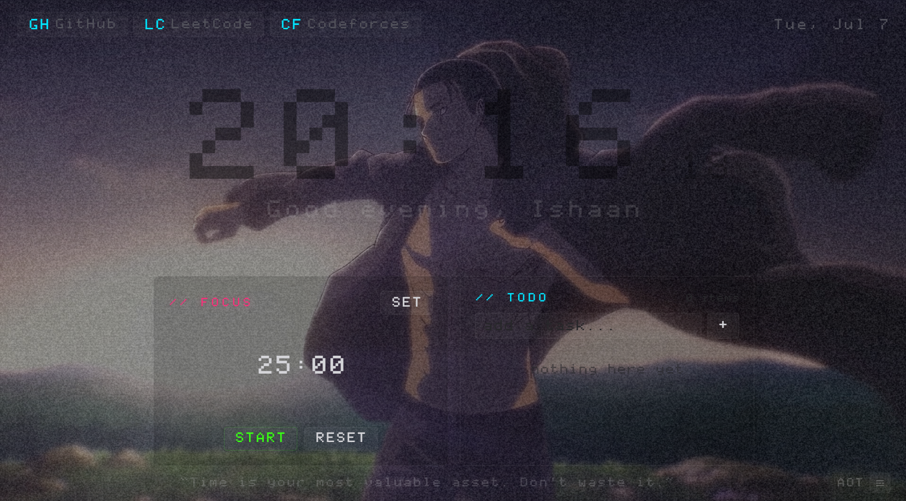
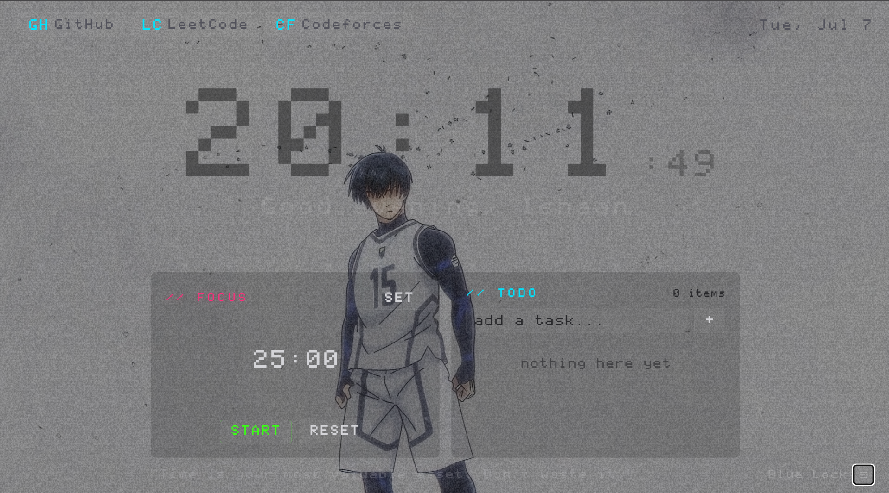
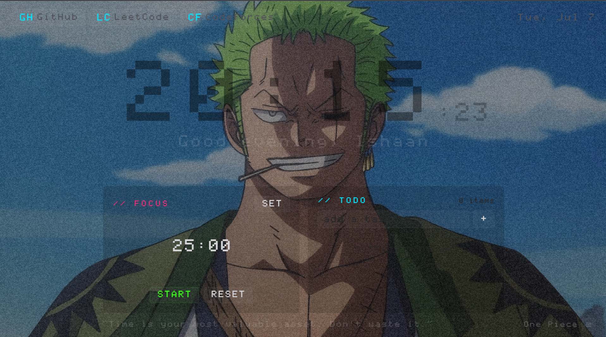
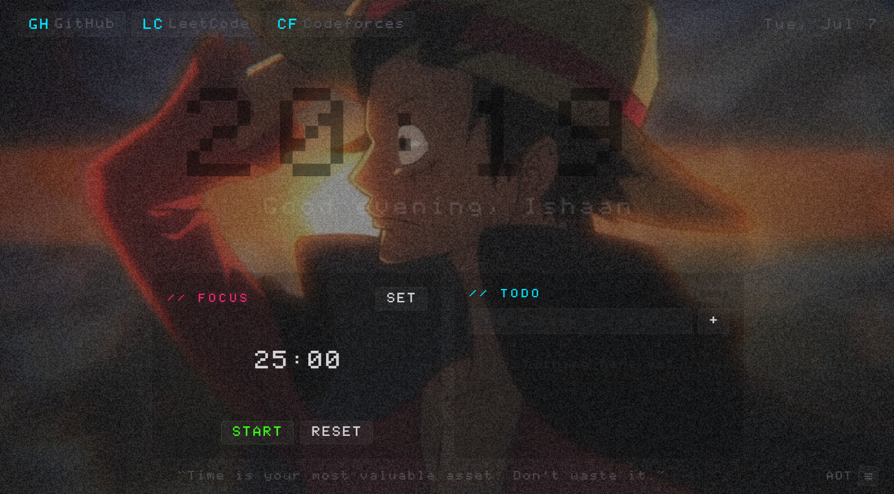

# MugenOS

**Your browser opens hundreds of times a day. Make the first thing you see something worth looking at.**

MugenOS turns your new tab into a living, breathing space where your favorite clips behind film grain, a focus timer that keeps you honest, and a vibe that's entirely yours. No accounts. No cloud. Just your laptop, your clips, your rules.

*Mugen (無限) - Japanese for infinite, limitless.*

---

## Why this exists

Every productivity tool wants your attention. MugenOS doesn't. It sits quietly in your new tab, plays whatever you want behind a film-grain overlay, counts down your focus sessions, and gets out of the way. It's not an app, it's an atmosphere.

Built because the default new tab page is the most wasted screen on your computer.

---

## What you get

- **Anime video wallpapers** - Group clips by anime. Select "One Piece" and Zoro, Luffy play in sequence on loop. Select "AOT" and Eren takes over. Add any .mp4 clip you want.
- **Film grain + CRT scanlines** - Canvas-generated noise overlay that makes everything look cinematic. No external assets needed.
- **Focus timer** - Pomodoro with configurable work/break durations. Auto-cycles between focus and rest. Tracks completed sessions.
- **Todo list** - Quick task capture right in your new tab. Add, check off, clear done.
- **Music player** - Drop .mp3 files in, pick a track, let it play while you work. Hidden entirely if you don't add music.
- **Quick links** - Your three most-used sites, one click away.
- **Motivational quotes** - Rotating quotes at the bottom. Customizable.
- **Translucent everything** - Widgets are glass-thin so your wallpaper shows through. The video is the hero, not the UI.
> **Note:** MugenOS ships without video clips and the clips used by me are also edits of anime clips. Use fan edits and clips
> available publicly online - don't use direct footage from OTT platforms 
> or streaming services. Short edits from communities like animeclipsraw.fr which provides clips of all categories you want, 
> fan montages from YouTube, or any publicly shared clips work perfectly.

---

## Screenshots

*Customize this and give it your unique touch and identity to it*

| | |
|---|---|
|  |  | 
 | 

---

## Quick start

### 1. Clone it

```bash
git clone https://github.com/Ishaan2510/MugenOS.git
cd MugenOS
npm install
```

### 2. Add your video clips

Drop .mp4 files into the `public/` folder. Short clips (3-10 seconds) work perfectly - the grain overlay masks the loop point, so even a 4-second Zoro slash looks like a live wallpaper.

### 3. Configure

Open `src/app/page.tsx`. Everything you need to change is in the config block at the top:

```typescript
// Your name
const USER_NAME = "Ishaan";

// Video playlists grouped by anime
const PLAYLISTS = [
  { name: "Blue Lock", videos: ["isagi.mp4", "nagi.mp4"] },
  { name: "One Piece", videos: ["zoro_1.mp4", "luffy_1.mp4"] },
  { name: "AOT", videos: ["eren_1.mp4", "eren_2.mp4"] },
];

// Music (optional - leave empty to hide the player)
const MUSIC = [
  { name: "Unravel", file: "music/unravel.mp3" },
];

// Quick links
const LINKS = [
  { name: "GitHub", url: "https://github.com/...", tag: "GH" },
];
```

That's it. No other files to touch.

### 4. Run it

```bash
npm run dev
```

Open `http://localhost:3000`. Set it as your browser homepage in Chrome Settings > On startup > Open a specific page.

### 5. (Optional) Deploy to Vercel

Connect the repo to [Vercel](https://vercel.com) for free. Now you can access your dashboard from any device - Mac, Windows, phone - by visiting the URL. No local server needed.

---

## Chrome extension (no server needed)

If you don't want to run `npm run dev` every time:

**Option A: Download the release**

1. Go to [Releases](https://github.com/Ishaan2510/MugenOS/releases)
2. Download the latest `.zip`
3. Extract it to a folder
4. Drop your `.mp4` clips into that folder
5. Open `chrome://extensions`, enable Developer mode
6. Click "Load unpacked", select the folder
7. Open a new tab

**Option B: Build from source**

```bash
npm run build
node build-extension.js
copy public/*.mp4 out/    # Windows
cp public/*.mp4 out/      # Mac/Linux
```

Then load the `out/` folder as an unpacked extension in `chrome://extensions`.

## Where to get clips

You don't need long cinematic edits. Short raw clips work best with the grain overlay.

| Source | What you get | Link |
|--------|-------------|------|
| animeclips.online | Pre-cut raw clips, original framerate, no watermarks | [animeclips.online](https://animeclips.online) |
| hiitwixtor.com | 1080p clips saved to Google Drive, sorted by character | [hiitwixtor.com](https://hiitwixtor.com) |
| animeclipsraw.fr | Raw clips with Mega/GDrive links | [animeclipsraw.fr](https://animeclipsraw.fr) |
| YouTube (via yt-dlp) | Full AMV edits - longer, already cinematic | `pip install yt-dlp` then `yt-dlp -o "public/%(title)s.%(ext)s" "URL"` |

---

## Customization guide

### Change the grain intensity

In `src/app/page.tsx`, find `d.data[i + 3] = 45;` - this controls grain opacity. Lower = subtle (try 20), higher = heavy VHS look (try 60).

### Change video brightness

In `src/app/globals.css`, find `filter: brightness(0.55);` on `.video-bg`. Lower = darker (try 0.4 for bright clips), higher = more visible (try 0.7 for dark clips).

### Change the clock color/opacity

In `src/app/globals.css`, find `.clock-main`. The `color: rgba(0, 229, 255, 0.4)` controls clock transparency. Change the last value (0.4) to make it more or less visible.

### Change the accent color

The cyan accent `#00e5ff` appears throughout. Search and replace it in globals.css with any color - try `#ff6b35` for orange, `#a855f7` for purple, `#22d3ee` for teal.

### Add more quotes

In `src/app/page.tsx`, add objects to the `QUOTES` array: `{ text: "Your quote", author: "Who said it" }`. Leave `author: ""` to show the quote without attribution.

### Change the font

The retro pixel font is `hokageFont.ttf` loaded in `src/app/layout.tsx`. Replace the .ttf file with any font you want and it applies everywhere.

---

## Tech stack

- **Next.js 14** - React framework
- **TypeScript** - Type safety
- **Tailwind CSS** - Utility styling
- **Canvas API** - Grain texture generation (no external image dependency)
- **Zero external APIs** - Everything runs locally, no accounts, no tracking

---

## Project structure

```
MugenOS/
├── public/
│   ├── favicon.svg          # Torii gate logo
│   ├── your-clips.mp4       # Your video files go here
│   └── music/               # Your .mp3 files go here
├── src/
│   └── app/
│       ├── page.tsx          # Main dashboard (all config at top)
│       ├── globals.css       # All styles
│       ├── layout.tsx        # Metadata, font loading
│       └── hokageFont.ttf    # Retro pixel font
├── package.json
└── README.md
```

---

## Make it yours

This is designed to be forked. The entire personality of the dashboard lives in one config block at the top of `page.tsx`. Change the name, swap the clips, pick your quotes, add your links - and you have something that feels like it was built just for you.

If you build something cool with it, open a PR or tag [@Ishaan2510](https://github.com/Ishaan2510) - would love to see what people do with this.

---

## License

MIT - do whatever you want with it.